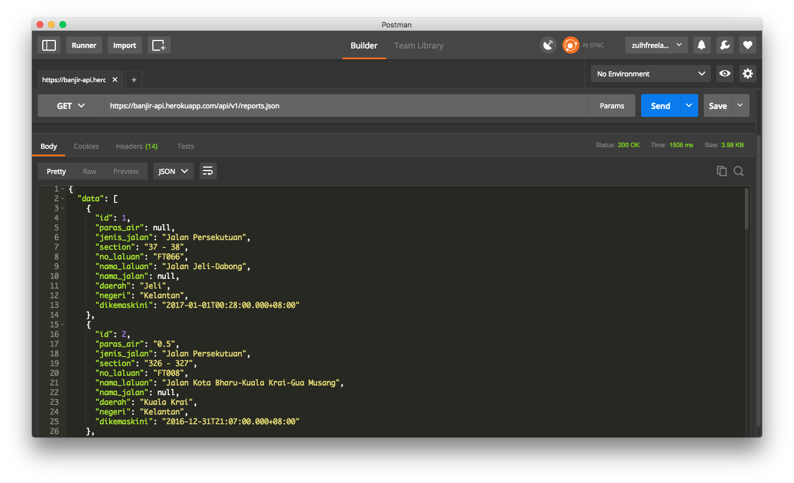

## Banjir API

Malaysia flood JSON API. Data from [JKR Malaysia](http://bencanaalam.jkr.gov.my/v2/).

https://banjir-api.herokuapp.com/api/v1/reports.json

### About

1. Built with Ruby on Rails 5.0.1
2. Deployed on Heroku on midnight of 01 Jan 2017 :tada: :fireworks: :sparkles:
3. Data updated every 1 hour

### Known Issues

- The `null` values are originated from empty values from the source (JKR) site

### Nice To Have

- Special route for `/daerah.json`
- Special route for `/negeri.json`
- Special route for `/negeri/daerah.json`

### Contribute

Feel free to fork this project and improve it. Submit your Pull Request for merge review. :muscle:

